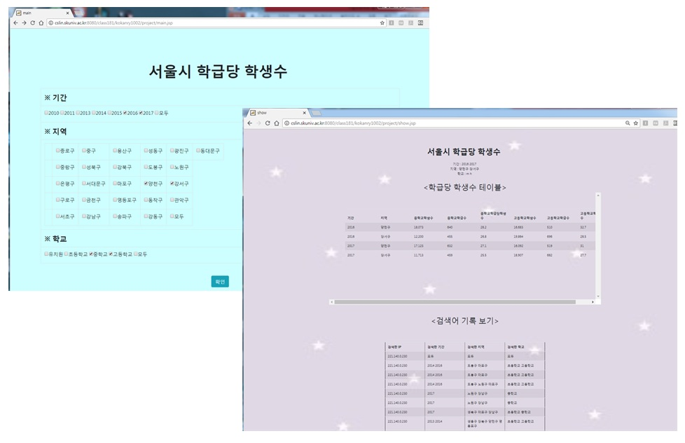

# JspDBSearch2018

# 기간
    1개월 (2018-05-08 ~ 2018-06-15)
  
  
  
# 개요
    공공데이터포털의 문서로 공개된 데이터를 MySQL에 저장하고
    , JSP 문법을 사용해 DB와 연동하여 데이터를 검색, 보여줍니다.

# 사용한 라이브러리 및 구현 환경
    1. 구현 환경
        - eclipse
        - Java
        - MySQL
        - JSP
        - LINUX
    2. 사용한 라이브러리 및 기능
        - Bootstrap을 사용한 UI 구현
        
        
        
# 필요 기능과 과정
    1. 저장된 데이터를 MySQL에 저장
    2. ip 에 따른 검색어 기록을 표출
    3. UI : 사용자에게 보여질 화면
        - checkbox로 자신이 원하는 정보 선택, DB에서 선택한 정보를 가져와 보여줍니다.
        - ip에 따른 검색어 기록을 보여줍니다.
    
    
    
# 구현 화면

# 주요 기능별 소스코드 설명
    1. 각자 db에 저장
        - createDB.sql 만들어서 실행시킴.

    2. 각 필드 내용 검색 (checkbox 형식으로 복수선택하게끔 해서)
        - checkbox 형식으로 복수선택하게끔 해서 form으로 넘김.

    3. 검색 내용따라 결과 표현
        1) db 연결해놓고
        2) sql문 만든다.
            - select 할 것 정하고
            - 다 정하고 나서는 “where student_count ” 붙여 적어주고
            - 다음으로 where 다음에 들어갈 문구 만들어 붙여줌.
            - resultset으로 받아서 테이블형식으로 표시해줌.
        * 길이가 길어지면 보기 힘드므로 스크롤을 만들어줌.
        * bootstrap 사용해 테이블 형태 만들어줌.

    4. 각 검색자가 조회한 검색어, IP 가져와 DB에 저장/보이기
        1) ip를 request.getRemoteAddr()로 받고,
        2) searcher 테이블에 넣기위해 sql문 만든다.
            - 기간, 지역, 학교 순으로 띄어쓰기로 넣어줌.
                ex) insert into searcher values(‘ip’,‘2016 2017’,‘영등포구 강서구’,‘중학교 고등학교’)
                    식으로 만들어서 넣어줌.
